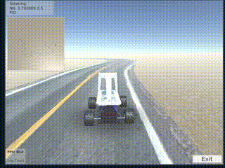

# learning-to-drive-in-a-day

DISCLAIMER: This repo is a boilerplate for the approach described in paper. It works in general, but not stable enough to reproduce good policy in 100% cases. I recommend to play with [pretrained VAE](#disable-vae-optimization) to get quicker results.



Video with [real RC car](https://www.youtube.com/watch?v=6JUjDw9tfD4).

Code that implements approach similar to described in ["Learning to Drive in a Day"](https://arxiv.org/pdf/1807.00412.pdf) paper.

Missing parts:
- Prioritized Experience Replay in DDPG. Right now we randomly sample.
- Params well tuning to drive more smoothly.

# Quick start

NOTE: Assuming Intel Graphics (`/dev/dri`) present.

Download compiled [Donkey Car simulator](https://drive.google.com/open?id=1sK2luxKYV1cpaZLhVwfXrmGU3TRa5C3B) ([source](https://github.com/tawnkramer/sdsandbox/tree/donkey)) into `$HOME/sim` directory.

Run training.
```
docker build -t learning-to-drive-in-a-day .
./run-in-docker.sh
```

Run test with the same command (script run test if there are trained models `ddpg.pkl` and `vae.json`).
```
./run-in-docker.sh
```

# Under the hood

Script does the following:
- Initialize Donkey OpenAI gym environment.
- Initialize VAE controller with random weights.
- If no pretrained models found, run in train mode. Otherwise just load weights from files and run test.
- Initialize DDPG controller.
- Learning function will collect the data by running 10 episodes w/o DDPG optimization, then after every episode DDPG optimization happens. VAE optimized after every episode.
- After 3000 steps training will be finished and weights params will be saved to files.

# Troubleshooting

## Disable VAE optimization

Implementation is still very very raw and needs fine tuning, so to get quick results i recommend to run full session and then reuse `vae.json` (or use [pretrained](https://drive.google.com/open?id=16WYkH7goKnJM52ke1KAzs5vozGiuKPqu)) in new training session by adding `vae.load(PATH_MODEL_VAE)` before `ddpg.learn` and commenting out `vae.optimize()` in `ddpg_with_vae.py`. This will allow to train DDPG very quickly even on CPU machine.

## Visualize what car sees

Following code can be used to decode VAE's Z latent vector and save to image.

```
arr = vae.decode(obs)
arr = np.round(arr).astype(np.uint8)
arr = arr.reshape(80, 160, 3)
# pip install Pillow
img = PIL.Image.fromarray(arr)
img.save('decoded_img.jpg')
```

Add this code in test section of `run.py`.

## Try pretrained models

Just to make sure that environment was setup correctly try [pretrained models](https://drive.google.com/open?id=16WYkH7goKnJM52ke1KAzs5vozGiuKPqu). Place `ddpg.pkl` and `vae.json` into the root directory and run `./run-in-docker.sh`. You should see similar to the GIF above.

# Credits

- [wayve.ai](wayve.ai) for idea and inspiration.
- [Tawn Kramer](https://github.com/tawnkramer) for Donkey simulator and Donkey Gym.
- [stable-baselines](https://github.com/hill-a/stable-baselines) for DDPG implementation.
- [world models experiments](https://github.com/hardmaru/WorldModelsExperiments) for VAE implementation.
